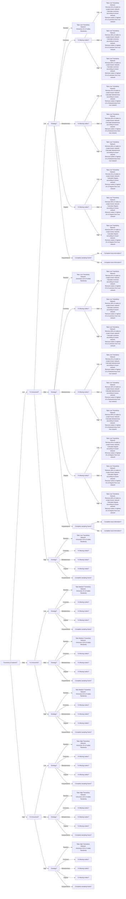

```mermaid
graph LR
A[Transitivity of network?] -->|Low|L[% Immunized?]
A[Transitivity of network?] -->|Med|M[% Immunized?]
A[Transitivity of network?] -->|High|H[% Immunized?]


L[% Immunized?] -->|Low|LL[Strategy?]
L[% Immunized?] -->|Med|LM[Strategy?]
L[% Immunized?] -->|High|LH[Strategy?]

M[% Immunized?] -->|Low|ML[Strategy?]
M[% Immunized?] -->|Med|MM[Strategy?]
M[% Immunized?] -->|High|MH[Strategy?]

H[% Immunized?] -->|Low|HL[Strategy?]
H[% Immunized?] -->|Med|HM[Strategy?]
H[% Immunized?] -->|High|HH[Strategy?]


LL[Strategy?] -->|Random|LLR[Take Low Tranisitivty Network <br> Immunize 1% of nodes <br> Randomly]
LL[Strategy?] -->|Coreness|LLC[% Missing nodes?]
LL[Strategy?] -->|Betweenness|LLB[% Missing nodes?]
LL[Strategy?] -->|Degree|LLD[% Missing nodes?]
LL[Strategy?] -->|Acquaintance|LLA[Complete sampling frame?]

LM[Strategy?] -->|Random|LMR[Take Low Tranisitivty Network <br> Immunize 11% of nodes <br> Randomly]
LM[Strategy?] -->|Coreness|LMC[% Missing nodes?]
LM[Strategy?] -->|Betweenness|LMB[% Missing nodes?]
LM[Strategy?] -->|Degree|LMD[% Missing nodes?]
LM[Strategy?] -->|Acquaintance|LMA[Complete sampling frame?]

LH[Strategy?] -->|Random|LHR[Take Low Tranisitivty Network <br> Immunize 21% of nodes <br> Randomly]
LH[Strategy?] -->|Coreness|LHC[% Missing nodes?]
LH[Strategy?] -->|Betweenness|LHB[% Missing nodes?]
LH[Strategy?] -->|Degree|LHD[% Missing nodes?]
LH[Strategy?] -->|Acquaintance|LHA[Complete sampling frame?]


ML[Strategy?] -->|Random|MLR[Take Medium Tranisitivty Network <br> Immunize 1% of nodes <br> Randomly]
ML[Strategy?] -->|Coreness|MLC[% Missing nodes?]
ML[Strategy?] -->|Betweenness|MLB[% Missing nodes?]
ML[Strategy?] -->|Degree|MLD[% Missing nodes?]
ML[Strategy?] -->|Acquaintance|MLA[Complete sampling frame?]

MM[Strategy?] -->|Random|MMR[Take Medium Tranisitivty Network <br> Immunize 11% of nodes <br> Randomly]
MM[Strategy?] -->|Coreness|MMC[% Missing nodes?]
MM[Strategy?] -->|Betweenness|MMB[% Missing nodes?]
MM[Strategy?] -->|Degree|MMD[% Missing nodes?]
MM[Strategy?] -->|Acquaintance|MMA[Complete sampling frame?]

MH[Strategy?] -->|Random|MHR[Take Medium Tranisitivty Network <br> Immunize 21% of nodes <br> Randomly]
MH[Strategy?] -->|Coreness|MHC[% Missing nodes?]
MH[Strategy?] -->|Betweenness|MHB[% Missing nodes?]
MH[Strategy?] -->|Degree|MHD[% Missing nodes?]
MH[Strategy?] -->|Acquaintance|MHA[Complete sampling frame?]


HL[Strategy?] -->|Random|HLR[Take High Tranisitivty Network <br> Immunize 1% of nodes <br> Randomly]
HL[Strategy?] -->|Coreness|HLC[% Missing nodes?]
HL[Strategy?] -->|Betweenness|HLB[% Missing nodes?]
HL[Strategy?] -->|Degree|HLD[% Missing nodes?]
HL[Strategy?] -->|Acquaintance|HLA[Complete sampling frame?]

HM[Strategy?] -->|Random|HMR[Take High Tranisitivty Network <br> Immunize 11% of nodes <br> Randomly]
HM[Strategy?] -->|Coreness|HMC[% Missing nodes?]
HM[Strategy?] -->|Betweenness|HMB[% Missing nodes?]
HM[Strategy?] -->|Degree|HMD[% Missing nodes?]
HM[Strategy?] -->|Acquaintance|HMA[Complete sampling frame?]

HH[Strategy?] -->|Random|HHR[Take High Tranisitivty Network <br> Immunize 21% of nodes <br> Randomly]
HH[Strategy?] -->|Coreness|HHC[% Missing nodes?]
HH[Strategy?] -->|Betweenness|HHB[% Missing nodes?]
HH[Strategy?] -->|Degree|HHD[% Missing nodes?]
HH[Strategy?] -->|Acquaintance|HHA[Complete sampling frame?]


LLC[% Missing nodes?] -->|Low|LLCL[Take Low Tranisitivty Network <br> Remove 0% of nodes to create known network <br> Calculate coreness according to known network <br> Remove nodes in highest 1% of coreness from true network ]
LLC[% Missing nodes?] -->|Med|LLCM[Take Low Tranisitivty Network <br> Remove 30% of nodes to create known network <br> Calculate coreness according to known network <br> Remove nodes in highest 1% of coreness from true network ]
LLC[% Missing nodes?] -->|High|LLCH[Take Low Tranisitivty Network <br> Remove 60% of nodes to create known network <br> Calculate coreness according to known network <br> Remove nodes in highest 1% of coreness from true network ]

LLB[% Missing nodes?] -->|Low|LLBL[Take Low Tranisitivty Network <br> Remove 0% of nodes to create known network <br> Calculate betweenness according to known network <br> Remove nodes in highest 1% of betweenness from true network ]
LLB[% Missing nodes?] -->|Med|LLBM[Take Low Tranisitivty Network <br> Remove 30% of nodes to create known network <br> Calculate betweenness according to known network <br> Remove nodes in highest 1% of betweenness from true network ]
LLB[% Missing nodes?] -->|High|LLBH[Take Low Tranisitivty Network <br> Remove 60% of nodes to create known network <br> Calculate betweenness according to known network <br> Remove nodes in highest 1% of betweenness from true network ]

LLD[% Missing nodes?] -->|Low|LLDL[Take Low Tranisitivty Network <br> Remove 0% of nodes to create known network <br> Calculate Degree according to known network <br> Remove nodes in highest 1% of Degree from true network ]
LLD[% Missing nodes?] -->|Med|LLDM[Take Low Tranisitivty Network <br> Remove 30% of nodes to create known network <br> Calculate Degree according to known network <br> Remove nodes in highest 1% of Degree from true network ]
LLD[% Missing nodes?] -->|High|LLDH[Take Low Tranisitivty Network <br> Remove 60% of nodes to create known network <br> Calculate Degree according to known network <br> Remove nodes in highest 1% of Degree from true network ]

LLA[Complete sampling frame?] -->|No|LLAN[Complete local information?]
LLA[Complete sampling frame?] -->|Yes|LLAY[Complete local information?]


LMC[% Missing nodes?] -->|Low|LMCL[Take Low Tranisitivty Network <br> Remove 0% of nodes to create known network <br> Calculate coreness according to known network <br> Remove nodes in highest 1% of coreness from true network ]
LMC[% Missing nodes?] -->|Med|LMCM[Take Low Tranisitivty Network <br> Remove 30% of nodes to create known network <br> Calculate coreness according to known network <br> Remove nodes in highest 1% of coreness from true network ]
LMC[% Missing nodes?] -->|High|LMCH[Take Low Tranisitivty Network <br> Remove 60% of nodes to create known network <br> Calculate coreness according to known network <br> Remove nodes in highest 1% of coreness from true network ]

LMB[% Missing nodes?] -->|Low|LMBL[Take Low Tranisitivty Network <br> Remove 0% of nodes to create known network <br> Calculate betweenness according to known network <br> Remove nodes in highest 1% of betweenness from true network ]
LMB[% Missing nodes?] -->|Med|LMBM[Take Low Tranisitivty Network <br> Remove 30% of nodes to create known network <br> Calculate betweenness according to known network <br> Remove nodes in highest 1% of betweenness from true network ]
LMB[% Missing nodes?] -->|High|LMBH[Take Low Tranisitivty Network <br> Remove 60% of nodes to create known network <br> Calculate betweenness according to known network <br> Remove nodes in highest 1% of betweenness from true network ]

LMD[% Missing nodes?] -->|Low|LMDL[Take Low Tranisitivty Network <br> Remove 0% of nodes to create known network <br> Calculate Degree according to known network <br> Remove nodes in highest 1% of Degree from true network ]
LMD[% Missing nodes?] -->|Med|LMDM[Take Low Tranisitivty Network <br> Remove 30% of nodes to create known network <br> Calculate Degree according to known network <br> Remove nodes in highest 1% of Degree from true network ]
LMD[% Missing nodes?] -->|High|LMDH[Take Low Tranisitivty Network <br> Remove 60% of nodes to create known network <br> Calculate Degree according to known network <br> Remove nodes in highest 1% of Degree from true network ]

LMA[Complete sampling frame?] -->|No|LMAN[Complete local information?]
LMA[Complete sampling frame?] -->|Yes|LMAY[Complete local information?]

```

here is my desc

Test 

Desc for mock data