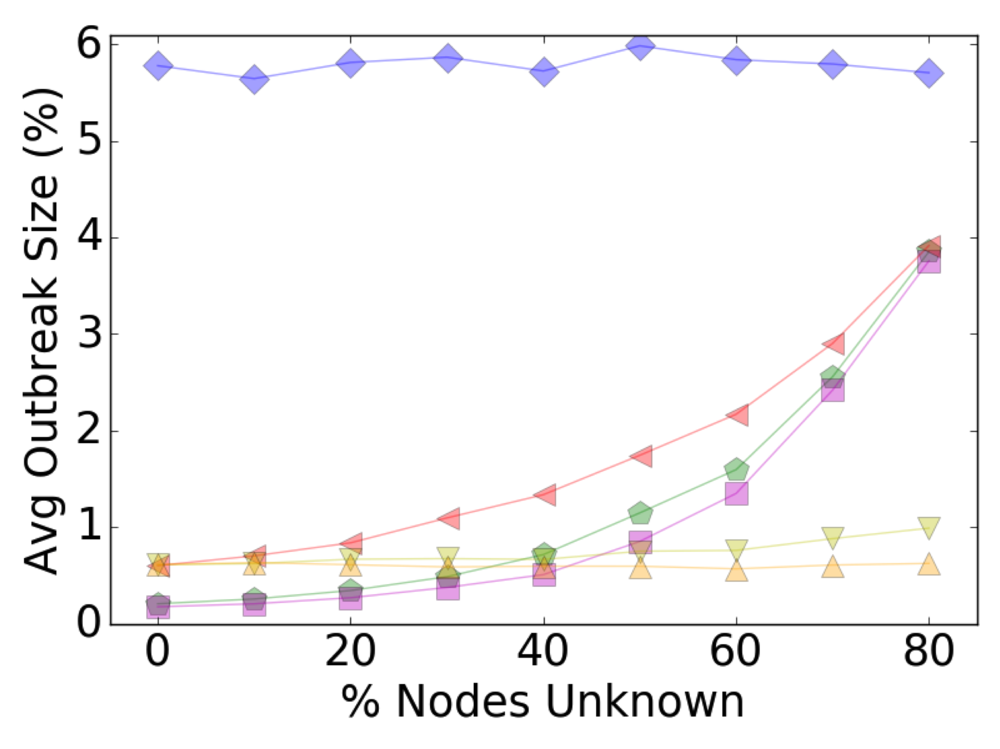

```{r}
library(tidyverse)
```

## Part 2

Dr. Gotelli: To start simply, assume that the data in each of your treatment groups follow a normal distribution. Specify the sample sizes, means, and variances for each group that would be reasonable if your hypothesis were true.

Sam: My variable of interest will be the percent of a simulated population infected by an SIR epidemic. The control group is the set of simulations where the population was is immunized through random immunization, whereas each treatment group is the set of simulations where the population is immunized(at the same immunization coverage) according to an immunization strategy particular to that treatment group(i.e. the different immunization strategies are the different "treatments")

To specify the sample sizes , means, and variances I used the below plot to approximate 
<p style="text-align:left;"></p>


## Part 3

Dr. Gotelli: Using the methods we have covered in class, write code to create a random data set that has these attributes. Organize these data into a data frame or tibble with the appropriate structure.

```{r}
nGroup <- 7 # number of treatment groups
nName <- c("RandomImmunization","BetweennessImmunization", "DegreeImmunization", "CorenessImmunization", "AcquaintanceKKimmunization", "AcquaintanceKGimmunization", "AcquaintanceGGimmunization" ) # names of groups
nSize <- c(10000,10000,10000, 10000, 10000, 10000, 10000) # number of observations in each group
nMean <- c(0.059,0.017,0.015, 0.05, 0.022, 0.007, 0.005) # mean of each group
nSD <- c(0.04, 0.01,0.01, 0.01, 0.025, 0.02, 0.015) # standard deviation of each group

ID <- 1:(sum(nSize)) # id vector for each row
resVar <- c(rnorm(n=nSize[1],mean=nMean[1],sd=nSD[1]),
            rnorm(n=nSize[2],mean=nMean[2],sd=nSD[2]),
            rnorm(n=nSize[3],mean=nMean[3],sd=nSD[3]),
            rnorm(n=nSize[4],mean=nMean[4],sd=nSD[4]),
            rnorm(n=nSize[5],mean=nMean[5],sd=nSD[5]),
            rnorm(n=nSize[6],mean=nMean[6],sd=nSD[6]),
            rnorm(n=nSize[7],mean=nMean[7],sd=nSD[7]))
TGroup <- rep(nName,nSize)
ANOdata <- data.frame(ID,TGroup,resVar)
str(ANOdata)
```

## Part 4
Dr. Gotelli: Now write code to analyze the data (probably as an ANOVA or regression analysis, but possibly as a logistic regression or contingency table analysis. 

Sam: We are comparing distributions of continuous variables so we will use ANOVA

```{r}
ANOmodel <- aov(resVar~TGroup,data=ANOdata)
print(ANOmodel)
print(summary(ANOmodel))
z <- summary(ANOmodel)
str(z)
aggregate(resVar~TGroup,data=ANOdata,FUN=mean)
unlist(z)
unlist(z)[7]
ANOsum <- list(Fval=unlist(z)[7],probF=unlist(z)[9])
ANOsum
```

Write code to generate a useful graph of the data.

```{r}
ANOPlot <- ggplot(data=ANOdata,aes(x=TGroup,y=resVar,fill=TGroup)) +
           geom_boxplot()  + scale_x_discrete(labels=c("AcqGG", "AcqKG", "AcqKK", "Bet","Core","Deg","Rand"))
print(ANOPlot)
# ggsave(filename="Plot2.pdf",plot=ANOPlot,device="pdf")
#+ theme(text = element_text(size=20), axis.text.x = element_text(angle=90, hjust=1))
```

## Part 5
Try running your analysis multiple times to get a feeling for how variable the results are with the same parameters, but different sets of random numbers.

###Same Parameters Run 2
```{r}
nGroup <- 7 # number of treatment groups
nName <- c("RandomImmunization","BetweennessImmunization", "DegreeImmunization", "CorenessImmunization", "AcquaintanceKKimmunization", "AcquaintanceKGimmunization", "AcquaintanceGGimmunization" ) # names of groups
nSize <- c(10000,10000,10000, 10000, 10000, 10000, 10000) # number of observations in each group
nMean <- c(0.059,0.017,0.015, 0.05, 0.022, 0.007, 0.005) # mean of each group
nSD <- c(0.04, 0.01,0.01, 0.01, 0.025, 0.02, 0.015) # standard deviation of each group

ID <- 1:(sum(nSize)) # id vector for each row
resVar <- c(rnorm(n=nSize[1],mean=nMean[1],sd=nSD[1]),
            rnorm(n=nSize[2],mean=nMean[2],sd=nSD[2]),
            rnorm(n=nSize[3],mean=nMean[3],sd=nSD[3]),
            rnorm(n=nSize[4],mean=nMean[4],sd=nSD[4]),
            rnorm(n=nSize[5],mean=nMean[5],sd=nSD[5]),
            rnorm(n=nSize[6],mean=nMean[6],sd=nSD[6]),
            rnorm(n=nSize[7],mean=nMean[7],sd=nSD[7]))
TGroup <- rep(nName,nSize)
ANOdata <- data.frame(ID,TGroup,resVar)
str(ANOdata)


 

ANOmodel <- aov(resVar~TGroup,data=ANOdata)
print(ANOmodel)
print(summary(ANOmodel))
z <- summary(ANOmodel)
str(z)
aggregate(resVar~TGroup,data=ANOdata,FUN=mean)
unlist(z)
unlist(z)[7]
ANOsum <- list(Fval=unlist(z)[7],probF=unlist(z)[9])
ANOsum


ANOPlot <- ggplot(data=ANOdata,aes(x=TGroup,y=resVar,fill=TGroup)) +
           geom_boxplot()  + scale_x_discrete(labels=c("AcqGG", "AcqKG", "AcqKK", "Bet","Core","Deg","Rand"))
print(ANOPlot)
# ggsave(filename="Plot2.pdf",plot=ANOPlot,device="pdf")
#+ theme(text = element_text(size=20), axis.text.x = element_text(angle=90, hjust=1))
```

###Same Parameters Run 3
```{r, echo=FALSE}
nGroup <- 7 # number of treatment groups
nName <- c("RandomImmunization","BetweennessImmunization", "DegreeImmunization", "CorenessImmunization", "AcquaintanceKKimmunization", "AcquaintanceKGimmunization", "AcquaintanceGGimmunization" ) # names of groups
nSize <- c(10000,10000,10000, 10000, 10000, 10000, 10000) # number of observations in each group
nMean <- c(0.059,0.017,0.015, 0.05, 0.022, 0.007, 0.005) # mean of each group
nSD <- c(0.04, 0.01,0.01, 0.01, 0.025, 0.02, 0.015) # standard deviation of each group

ID <- 1:(sum(nSize)) # id vector for each row
resVar <- c(rnorm(n=nSize[1],mean=nMean[1],sd=nSD[1]),
            rnorm(n=nSize[2],mean=nMean[2],sd=nSD[2]),
            rnorm(n=nSize[3],mean=nMean[3],sd=nSD[3]),
            rnorm(n=nSize[4],mean=nMean[4],sd=nSD[4]),
            rnorm(n=nSize[5],mean=nMean[5],sd=nSD[5]),
            rnorm(n=nSize[6],mean=nMean[6],sd=nSD[6]),
            rnorm(n=nSize[7],mean=nMean[7],sd=nSD[7]))
TGroup <- rep(nName,nSize)
ANOdata <- data.frame(ID,TGroup,resVar)
str(ANOdata)


 

ANOmodel <- aov(resVar~TGroup,data=ANOdata)
print(ANOmodel)
print(summary(ANOmodel))
z <- summary(ANOmodel)
str(z)
aggregate(resVar~TGroup,data=ANOdata,FUN=mean)
unlist(z)
unlist(z)[7]
ANOsum <- list(Fval=unlist(z)[7],probF=unlist(z)[9])
ANOsum


ANOPlot <- ggplot(data=ANOdata,aes(x=TGroup,y=resVar,fill=TGroup)) +
           geom_boxplot()  + scale_x_discrete(labels=c("AcqGG", "AcqKG", "AcqKK", "Bet","Core","Deg","Rand"))
print(ANOPlot)
# ggsave(filename="Plot2.pdf",plot=ANOPlot,device="pdf")
#+ theme(text = element_text(size=20), axis.text.x = element_text(angle=90, hjust=1))
```

###Same Parameters Run 4
```{r, echo=FALSE}
nGroup <- 7 # number of treatment groups
nName <- c("RandomImmunization","BetweennessImmunization", "DegreeImmunization", "CorenessImmunization", "AcquaintanceKKimmunization", "AcquaintanceKGimmunization", "AcquaintanceGGimmunization" ) # names of groups
nSize <- c(10000,10000,10000, 10000, 10000, 10000, 10000) # number of observations in each group
nMean <- c(0.059,0.017,0.015, 0.05, 0.022, 0.007, 0.005) # mean of each group
nSD <- c(0.04, 0.01,0.01, 0.01, 0.025, 0.02, 0.015) # standard deviation of each group

ID <- 1:(sum(nSize)) # id vector for each row
resVar <- c(rnorm(n=nSize[1],mean=nMean[1],sd=nSD[1]),
            rnorm(n=nSize[2],mean=nMean[2],sd=nSD[2]),
            rnorm(n=nSize[3],mean=nMean[3],sd=nSD[3]),
            rnorm(n=nSize[4],mean=nMean[4],sd=nSD[4]),
            rnorm(n=nSize[5],mean=nMean[5],sd=nSD[5]),
            rnorm(n=nSize[6],mean=nMean[6],sd=nSD[6]),
            rnorm(n=nSize[7],mean=nMean[7],sd=nSD[7]))
TGroup <- rep(nName,nSize)
ANOdata <- data.frame(ID,TGroup,resVar)
str(ANOdata)


 

ANOmodel <- aov(resVar~TGroup,data=ANOdata)
print(ANOmodel)
print(summary(ANOmodel))
z <- summary(ANOmodel)
str(z)
aggregate(resVar~TGroup,data=ANOdata,FUN=mean)
unlist(z)
unlist(z)[7]
ANOsum <- list(Fval=unlist(z)[7],probF=unlist(z)[9])
ANOsum


ANOPlot <- ggplot(data=ANOdata,aes(x=TGroup,y=resVar,fill=TGroup)) +
           geom_boxplot()  + scale_x_discrete(labels=c("AcqGG", "AcqKG", "AcqKK", "Bet","Core","Deg","Rand"))
print(ANOPlot)
# ggsave(filename="Plot2.pdf",plot=ANOPlot,device="pdf")
#+ theme(text = element_text(size=20), axis.text.x = element_text(angle=90, hjust=1))
```
Thoughts: The results are incredibly stable throughout each run using different sets of random numbers. This is likely due to the very large sample size and the large difference in the means between the control and the treatment groups.


## Part 6
Now begin adjusting the means of the different groups. Given the sample sizes you have chosen, how small can the differences between the groups be (the “effect size”) for you to still detect a significant pattern (p < 0.05)?

### Means Adjustment 1: For all treatment groups change the means so that they are approximately only 50% as far from the mean of the control group as they were in the original analysis
```{r}
nGroup <- 7 # number of treatment groups
nName <- c("RandomImmunization","BetweennessImmunization", "DegreeImmunization", "CorenessImmunization", "AcquaintanceKKimmunization", "AcquaintanceKGimmunization", "AcquaintanceGGimmunization" ) # names of groups
nSize <- c(10000,10000,10000, 10000, 10000, 10000, 10000) # number of observations in each group
nMean <- c(0.059,0.04,0.039, 0.055, 0.042, 0.03, 0.029) # mean of each group
nSD <- c(0.04, 0.01,0.01, 0.01, 0.025, 0.02, 0.015) # standard deviation of each group

ID <- 1:(sum(nSize)) # id vector for each row
resVar <- c(rnorm(n=nSize[1],mean=nMean[1],sd=nSD[1]),
            rnorm(n=nSize[2],mean=nMean[2],sd=nSD[2]),
            rnorm(n=nSize[3],mean=nMean[3],sd=nSD[3]),
            rnorm(n=nSize[4],mean=nMean[4],sd=nSD[4]),
            rnorm(n=nSize[5],mean=nMean[5],sd=nSD[5]),
            rnorm(n=nSize[6],mean=nMean[6],sd=nSD[6]),
            rnorm(n=nSize[7],mean=nMean[7],sd=nSD[7]))
TGroup <- rep(nName,nSize)
ANOdata <- data.frame(ID,TGroup,resVar)
str(ANOdata)


 

ANOmodel <- aov(resVar~TGroup,data=ANOdata)
print(ANOmodel)
print(summary(ANOmodel))
z <- summary(ANOmodel)
str(z)
aggregate(resVar~TGroup,data=ANOdata,FUN=mean)
unlist(z)
unlist(z)[7]
ANOsum <- list(Fval=unlist(z)[7],probF=unlist(z)[9])
ANOsum


ANOPlot <- ggplot(data=ANOdata,aes(x=TGroup,y=resVar,fill=TGroup)) +
           geom_boxplot()  + scale_x_discrete(labels=c("AcqGG", "AcqKG", "AcqKK", "Bet","Core","Deg","Rand"))
print(ANOPlot)
# ggsave(filename="Plot2.pdf",plot=ANOPlot,device="pdf")
#+ theme(text = element_text(size=20), axis.text.x = element_text(angle=90, hjust=1))
```
Result of Means Adjustment 1: p value is still unrealistically low


 
### Means Adjustment 2: reduce the difference in means by approximately 50% again
```{r}
nGroup <- 7 # number of treatment groups
nName <- c("RandomImmunization","BetweennessImmunization", "DegreeImmunization", "CorenessImmunization", "AcquaintanceKKimmunization", "AcquaintanceKGimmunization", "AcquaintanceGGimmunization" ) # names of groups
nSize <- c(10000,10000,10000, 10000, 10000, 10000, 10000) # number of observations in each group
nMean <- c(0.059,0.05,0.049, 0.057, 0.053, 0.046, 0.046) # mean of each group
nSD <- c(0.04, 0.01,0.01, 0.01, 0.025, 0.02, 0.015) # standard deviation of each group

ID <- 1:(sum(nSize)) # id vector for each row
resVar <- c(rnorm(n=nSize[1],mean=nMean[1],sd=nSD[1]),
            rnorm(n=nSize[2],mean=nMean[2],sd=nSD[2]),
            rnorm(n=nSize[3],mean=nMean[3],sd=nSD[3]),
            rnorm(n=nSize[4],mean=nMean[4],sd=nSD[4]),
            rnorm(n=nSize[5],mean=nMean[5],sd=nSD[5]),
            rnorm(n=nSize[6],mean=nMean[6],sd=nSD[6]),
            rnorm(n=nSize[7],mean=nMean[7],sd=nSD[7]))
TGroup <- rep(nName,nSize)
ANOdata <- data.frame(ID,TGroup,resVar)
str(ANOdata)


 

ANOmodel <- aov(resVar~TGroup,data=ANOdata)
print(ANOmodel)
print(summary(ANOmodel))
z <- summary(ANOmodel)
str(z)
aggregate(resVar~TGroup,data=ANOdata,FUN=mean)
unlist(z)
unlist(z)[7]
ANOsum <- list(Fval=unlist(z)[7],probF=unlist(z)[9])
ANOsum


ANOPlot <- ggplot(data=ANOdata,aes(x=TGroup,y=resVar,fill=TGroup)) +
           geom_boxplot()  + scale_x_discrete(labels=c("AcqGG", "AcqKG", "AcqKK", "Bet","Core","Deg","Rand"))
print(ANOPlot)
# ggsave(filename="Plot2.pdf",plot=ANOPlot,device="pdf")
#+ theme(text = element_text(size=20), axis.text.x = element_text(angle=90, hjust=1))
```
Result of Means Adjustment 2: p value is still unrealistically low


### Means Adjustment 3: reduce the difference in means by approximately 50% a third time
```{r}
nGroup <- 7 # number of treatment groups
nName <- c("RandomImmunization","BetweennessImmunization", "DegreeImmunization", "CorenessImmunization", "AcquaintanceKKimmunization", "AcquaintanceKGimmunization", "AcquaintanceGGimmunization" ) # names of groups
nSize <- c(10000,10000,10000, 10000, 10000, 10000, 10000) # number of observations in each group
nMean <- c(0.059,0.0545,0.054, 0.058, 0.056, 0.053, 0.053) # mean of each group
nSD <- c(0.04, 0.01,0.01, 0.01, 0.025, 0.02, 0.015) # standard deviation of each group

ID <- 1:(sum(nSize)) # id vector for each row
resVar <- c(rnorm(n=nSize[1],mean=nMean[1],sd=nSD[1]),
            rnorm(n=nSize[2],mean=nMean[2],sd=nSD[2]),
            rnorm(n=nSize[3],mean=nMean[3],sd=nSD[3]),
            rnorm(n=nSize[4],mean=nMean[4],sd=nSD[4]),
            rnorm(n=nSize[5],mean=nMean[5],sd=nSD[5]),
            rnorm(n=nSize[6],mean=nMean[6],sd=nSD[6]),
            rnorm(n=nSize[7],mean=nMean[7],sd=nSD[7]))
TGroup <- rep(nName,nSize)
ANOdata <- data.frame(ID,TGroup,resVar)
str(ANOdata)


 

ANOmodel <- aov(resVar~TGroup,data=ANOdata)
print(ANOmodel)
print(summary(ANOmodel))
z <- summary(ANOmodel)
str(z)
aggregate(resVar~TGroup,data=ANOdata,FUN=mean)
unlist(z)
unlist(z)[7]
ANOsum <- list(Fval=unlist(z)[7],probF=unlist(z)[9])
ANOsum


ANOPlot <- ggplot(data=ANOdata,aes(x=TGroup,y=resVar,fill=TGroup)) +
           geom_boxplot()  + scale_x_discrete(labels=c("AcqGG", "AcqKG", "AcqKK", "Bet","Core","Deg","Rand"))
print(ANOPlot)
# ggsave(filename="Plot2.pdf",plot=ANOPlot,device="pdf")
#+ theme(text = element_text(size=20), axis.text.x = element_text(angle=90, hjust=1))
```
Result of Means Adjustment 3: Ok well now at least the value is not less than half of machine epsilon. Lets keep going


### Means Adjustment 4: reduce the difference in means by approximately 50% a fourth time
```{r}
nGroup <- 7 # number of treatment groups
nName <- c("RandomImmunization","BetweennessImmunization", "DegreeImmunization", "CorenessImmunization", "AcquaintanceKKimmunization", "AcquaintanceKGimmunization", "AcquaintanceGGimmunization" ) # names of groups
nSize <- c(10000,10000,10000, 10000, 10000, 10000, 10000) # number of observations in each group
nMean <- c(0.059,0.057,0.0565, 0.0585, 0.058, 0.056, 0.056) # mean of each group
nSD <- c(0.04, 0.01,0.01, 0.01, 0.025, 0.02, 0.015) # standard deviation of each group

ID <- 1:(sum(nSize)) # id vector for each row
resVar <- c(rnorm(n=nSize[1],mean=nMean[1],sd=nSD[1]),
            rnorm(n=nSize[2],mean=nMean[2],sd=nSD[2]),
            rnorm(n=nSize[3],mean=nMean[3],sd=nSD[3]),
            rnorm(n=nSize[4],mean=nMean[4],sd=nSD[4]),
            rnorm(n=nSize[5],mean=nMean[5],sd=nSD[5]),
            rnorm(n=nSize[6],mean=nMean[6],sd=nSD[6]),
            rnorm(n=nSize[7],mean=nMean[7],sd=nSD[7]))
TGroup <- rep(nName,nSize)
ANOdata <- data.frame(ID,TGroup,resVar)
str(ANOdata)


 

ANOmodel <- aov(resVar~TGroup,data=ANOdata)
print(ANOmodel)
print(summary(ANOmodel))
z <- summary(ANOmodel)
str(z)
aggregate(resVar~TGroup,data=ANOdata,FUN=mean)
unlist(z)
unlist(z)[7]
ANOsum <- list(Fval=unlist(z)[7],probF=unlist(z)[9])
ANOsum


ANOPlot <- ggplot(data=ANOdata,aes(x=TGroup,y=resVar,fill=TGroup)) +
           geom_boxplot()  + scale_x_discrete(labels=c("AcqGG", "AcqKG", "AcqKK", "Bet","Core","Deg","Rand"))
print(ANOPlot)
# ggsave(filename="Plot2.pdf",plot=ANOPlot,device="pdf")
#+ theme(text = element_text(size=20), axis.text.x = element_text(angle=90, hjust=1))
```


Result of Means Adjustment 4: Lets keep going until we get p > 0.05


### Means Adjustment 5: reduce the difference in means by approximately 50% a fifth time
```{r}
nGroup <- 7 # number of treatment groups
nName <- c("RandomImmunization","BetweennessImmunization", "DegreeImmunization", "CorenessImmunization", "AcquaintanceKKimmunization", "AcquaintanceKGimmunization", "AcquaintanceGGimmunization" ) # names of groups
nSize <- c(10000,10000,10000, 10000, 10000, 10000, 10000) # number of observations in each group
nMean <- c(0.059,0.058,0.05725, 0.05875, 0.05875, 0.0575, 0.0575) # mean of each group
nSD <- c(0.04, 0.01,0.01, 0.01, 0.025, 0.02, 0.015) # standard deviation of each group

ID <- 1:(sum(nSize)) # id vector for each row
resVar <- c(rnorm(n=nSize[1],mean=nMean[1],sd=nSD[1]),
            rnorm(n=nSize[2],mean=nMean[2],sd=nSD[2]),
            rnorm(n=nSize[3],mean=nMean[3],sd=nSD[3]),
            rnorm(n=nSize[4],mean=nMean[4],sd=nSD[4]),
            rnorm(n=nSize[5],mean=nMean[5],sd=nSD[5]),
            rnorm(n=nSize[6],mean=nMean[6],sd=nSD[6]),
            rnorm(n=nSize[7],mean=nMean[7],sd=nSD[7]))
TGroup <- rep(nName,nSize)
ANOdata <- data.frame(ID,TGroup,resVar)
str(ANOdata)


 

ANOmodel <- aov(resVar~TGroup,data=ANOdata)
print(ANOmodel)
print(summary(ANOmodel))
z <- summary(ANOmodel)
str(z)
aggregate(resVar~TGroup,data=ANOdata,FUN=mean)
unlist(z)
unlist(z)[7]
ANOsum <- list(Fval=unlist(z)[7],probF=unlist(z)[9])
ANOsum


ANOPlot <- ggplot(data=ANOdata,aes(x=TGroup,y=resVar,fill=TGroup)) +
           geom_boxplot()  + scale_x_discrete(labels=c("AcqGG", "AcqKG", "AcqKK", "Bet","Core","Deg","Rand"))
print(ANOPlot)
# ggsave(filename="Plot2.pdf",plot=ANOPlot,device="pdf")
#+ theme(text = element_text(size=20), axis.text.x = element_text(angle=90, hjust=1))
```


Result of Means Adjustment 5: Lets keep going until we get p > 0.05

### Means Adjustment 6: reduce the difference in means by approximately 50% a sixth time
```{r}
nGroup <- 7 # number of treatment groups
nName <- c("RandomImmunization","BetweennessImmunization", "DegreeImmunization", "CorenessImmunization", "AcquaintanceKKimmunization", "AcquaintanceKGimmunization", "AcquaintanceGGimmunization" ) # names of groups
nSize <- c(10000,10000,10000, 10000, 10000, 10000, 10000) # number of observations in each group
nMean <- c(0.059,0.0585,0.058, 0.0589, 0.0589, 0.05825, 0.05825) # mean of each group
nSD <- c(0.04, 0.01,0.01, 0.01, 0.025, 0.02, 0.015) # standard deviation of each group

ID <- 1:(sum(nSize)) # id vector for each row
resVar <- c(rnorm(n=nSize[1],mean=nMean[1],sd=nSD[1]),
            rnorm(n=nSize[2],mean=nMean[2],sd=nSD[2]),
            rnorm(n=nSize[3],mean=nMean[3],sd=nSD[3]),
            rnorm(n=nSize[4],mean=nMean[4],sd=nSD[4]),
            rnorm(n=nSize[5],mean=nMean[5],sd=nSD[5]),
            rnorm(n=nSize[6],mean=nMean[6],sd=nSD[6]),
            rnorm(n=nSize[7],mean=nMean[7],sd=nSD[7]))
TGroup <- rep(nName,nSize)
ANOdata <- data.frame(ID,TGroup,resVar)
str(ANOdata)


 

ANOmodel <- aov(resVar~TGroup,data=ANOdata)
print(ANOmodel)
print(summary(ANOmodel))
z <- summary(ANOmodel)
str(z)
aggregate(resVar~TGroup,data=ANOdata,FUN=mean)
unlist(z)
unlist(z)[7]
ANOsum <- list(Fval=unlist(z)[7],probF=unlist(z)[9])
ANOsum


ANOPlot <- ggplot(data=ANOdata,aes(x=TGroup,y=resVar,fill=TGroup)) +
           geom_boxplot()  + scale_x_discrete(labels=c("AcqGG", "AcqKG", "AcqKK", "Bet","Core","Deg","Rand"))
print(ANOPlot)
# ggsave(filename="Plot2.pdf",plot=ANOPlot,device="pdf")
#+ theme(text = element_text(size=20), axis.text.x = element_text(angle=90, hjust=1))
```


Result of Means Adjustment 6: Almost there!

### Means Adjustment 7: reduce the difference in means by approximately 50% a seventh time
```{r}
nGroup <- 7 # number of treatment groups
nName <- c("RandomImmunization","BetweennessImmunization", "DegreeImmunization", "CorenessImmunization", "AcquaintanceKKimmunization", "AcquaintanceKGimmunization", "AcquaintanceGGimmunization" ) # names of groups
nSize <- c(10000,10000,10000, 10000, 10000, 10000, 10000) # number of observations in each group
nMean <- c(0.059,0.05875,0.0585, 0.05895, 0.05895, 0.0588, 0.0588) # mean of each group
nSD <- c(0.04, 0.01,0.01, 0.01, 0.025, 0.02, 0.015) # standard deviation of each group

ID <- 1:(sum(nSize)) # id vector for each row
resVar <- c(rnorm(n=nSize[1],mean=nMean[1],sd=nSD[1]),
            rnorm(n=nSize[2],mean=nMean[2],sd=nSD[2]),
            rnorm(n=nSize[3],mean=nMean[3],sd=nSD[3]),
            rnorm(n=nSize[4],mean=nMean[4],sd=nSD[4]),
            rnorm(n=nSize[5],mean=nMean[5],sd=nSD[5]),
            rnorm(n=nSize[6],mean=nMean[6],sd=nSD[6]),
            rnorm(n=nSize[7],mean=nMean[7],sd=nSD[7]))
TGroup <- rep(nName,nSize)
ANOdata <- data.frame(ID,TGroup,resVar)
str(ANOdata)


 

ANOmodel <- aov(resVar~TGroup,data=ANOdata)
print(ANOmodel)
print(summary(ANOmodel))
z <- summary(ANOmodel)
str(z)
aggregate(resVar~TGroup,data=ANOdata,FUN=mean)
unlist(z)
unlist(z)[7]
ANOsum <- list(Fval=unlist(z)[7],probF=unlist(z)[9])
ANOsum


ANOPlot <- ggplot(data=ANOdata,aes(x=TGroup,y=resVar,fill=TGroup)) +
           geom_boxplot()  + scale_x_discrete(labels=c("AcqGG", "AcqKG", "AcqKK", "Bet","Core","Deg","Rand"))
print(ANOPlot)
# ggsave(filename="Plot2.pdf",plot=ANOPlot,device="pdf")
#+ theme(text = element_text(size=20), axis.text.x = element_text(angle=90, hjust=1))
```


Result of Means Adjustment 6: Woohoo! We did it! With the differences in means between the control group and the treatment groups approximately (1/2)^7 of their original difference, we no longer see p values below 0.05. This is likely due to the very high sample size.

## Part 7
Alternatively, for the effect sizes you originally hypothesized, what is the minimum sample size you would need in order to detect a statistically significant effect? Again, run the model a few times with the same parameter set to get a feeling for the effect of random variation in the data

###Cut 1: N = (1/2)N_original, Run 1
```{r}
nGroup <- 7 # number of treatment groups
nName <- c("RandomImmunization","BetweennessImmunization", "DegreeImmunization", "CorenessImmunization", "AcquaintanceKKimmunization", "AcquaintanceKGimmunization", "AcquaintanceGGimmunization" ) # names of groups
N <- 5000
nSize <- c(N,N,N, N, N, N, N) # number of observations in each group
nMean <- c(0.059,0.017,0.015, 0.05, 0.022, 0.007, 0.005) # mean of each group
nSD <- c(0.04, 0.01,0.01, 0.01, 0.025, 0.02, 0.015) # standard deviation of each group

ID <- 1:(sum(nSize)) # id vector for each row
resVar <- c(rnorm(n=nSize[1],mean=nMean[1],sd=nSD[1]),
            rnorm(n=nSize[2],mean=nMean[2],sd=nSD[2]),
            rnorm(n=nSize[3],mean=nMean[3],sd=nSD[3]),
            rnorm(n=nSize[4],mean=nMean[4],sd=nSD[4]),
            rnorm(n=nSize[5],mean=nMean[5],sd=nSD[5]),
            rnorm(n=nSize[6],mean=nMean[6],sd=nSD[6]),
            rnorm(n=nSize[7],mean=nMean[7],sd=nSD[7]))
TGroup <- rep(nName,nSize)
ANOdata <- data.frame(ID,TGroup,resVar)
str(ANOdata)


 

ANOmodel <- aov(resVar~TGroup,data=ANOdata)
print(ANOmodel)
print(summary(ANOmodel))
z <- summary(ANOmodel)
str(z)
aggregate(resVar~TGroup,data=ANOdata,FUN=mean)
unlist(z)
unlist(z)[7]
ANOsum <- list(Fval=unlist(z)[7],probF=unlist(z)[9])
ANOsum


ANOPlot <- ggplot(data=ANOdata,aes(x=TGroup,y=resVar,fill=TGroup)) +
           geom_boxplot()  + scale_x_discrete(labels=c("AcqGG", "AcqKG", "AcqKK", "Bet","Core","Deg","Rand"))
print(ANOPlot)
# ggsave(filename="Plot2.pdf",plot=ANOPlot,device="pdf")
#+ theme(text = element_text(size=20), axis.text.x = element_text(angle=90, hjust=1))
```

###Cut N = (1/2)N_original, Run 2
```{r}
nGroup <- 7 # number of treatment groups
nName <- c("RandomImmunization","BetweennessImmunization", "DegreeImmunization", "CorenessImmunization", "AcquaintanceKKimmunization", "AcquaintanceKGimmunization", "AcquaintanceGGimmunization" ) # names of groups
N <- 5000
nSize <- c(N,N,N, N, N, N, N) # number of observations in each group
nMean <- c(0.059,0.017,0.015, 0.05, 0.022, 0.007, 0.005) # mean of each group
nSD <- c(0.04, 0.01,0.01, 0.01, 0.025, 0.02, 0.015) # standard deviation of each group

ID <- 1:(sum(nSize)) # id vector for each row
resVar <- c(rnorm(n=nSize[1],mean=nMean[1],sd=nSD[1]),
            rnorm(n=nSize[2],mean=nMean[2],sd=nSD[2]),
            rnorm(n=nSize[3],mean=nMean[3],sd=nSD[3]),
            rnorm(n=nSize[4],mean=nMean[4],sd=nSD[4]),
            rnorm(n=nSize[5],mean=nMean[5],sd=nSD[5]),
            rnorm(n=nSize[6],mean=nMean[6],sd=nSD[6]),
            rnorm(n=nSize[7],mean=nMean[7],sd=nSD[7]))
TGroup <- rep(nName,nSize)
ANOdata <- data.frame(ID,TGroup,resVar)
str(ANOdata)


 

ANOmodel <- aov(resVar~TGroup,data=ANOdata)
print(ANOmodel)
print(summary(ANOmodel))
z <- summary(ANOmodel)
str(z)
aggregate(resVar~TGroup,data=ANOdata,FUN=mean)
unlist(z)
unlist(z)[7]
ANOsum <- list(Fval=unlist(z)[7],probF=unlist(z)[9])
ANOsum


ANOPlot <- ggplot(data=ANOdata,aes(x=TGroup,y=resVar,fill=TGroup)) +
           geom_boxplot()  + scale_x_discrete(labels=c("AcqGG", "AcqKG", "AcqKK", "Bet","Core","Deg","Rand"))
print(ANOPlot)
# ggsave(filename="Plot2.pdf",plot=ANOPlot,device="pdf")
#+ theme(text = element_text(size=20), axis.text.x = element_text(angle=90, hjust=1))
```

###Cut 1: N = (1/2)N_original, Run 3
```{r}
nGroup <- 7 # number of treatment groups
nName <- c("RandomImmunization","BetweennessImmunization", "DegreeImmunization", "CorenessImmunization", "AcquaintanceKKimmunization", "AcquaintanceKGimmunization", "AcquaintanceGGimmunization" ) # names of groups
N <- 5000
nSize <- c(N,N,N, N, N, N, N) # number of observations in each group
nSD <- c(0.04, 0.01,0.01, 0.01, 0.025, 0.02, 0.015) # standard deviation of each group

ID <- 1:(sum(nSize)) # id vector for each row
resVar <- c(rnorm(n=nSize[1],mean=nMean[1],sd=nSD[1]),
            rnorm(n=nSize[2],mean=nMean[2],sd=nSD[2]),
            rnorm(n=nSize[3],mean=nMean[3],sd=nSD[3]),
            rnorm(n=nSize[4],mean=nMean[4],sd=nSD[4]),
            rnorm(n=nSize[5],mean=nMean[5],sd=nSD[5]),
            rnorm(n=nSize[6],mean=nMean[6],sd=nSD[6]),
            rnorm(n=nSize[7],mean=nMean[7],sd=nSD[7]))
TGroup <- rep(nName,nSize)
ANOdata <- data.frame(ID,TGroup,resVar)
str(ANOdata)


 

ANOmodel <- aov(resVar~TGroup,data=ANOdata)
print(ANOmodel)
print(summary(ANOmodel))
z <- summary(ANOmodel)
str(z)
aggregate(resVar~TGroup,data=ANOdata,FUN=mean)
unlist(z)
unlist(z)[7]
ANOsum <- list(Fval=unlist(z)[7],probF=unlist(z)[9])
ANOsum


ANOPlot <- ggplot(data=ANOdata,aes(x=TGroup,y=resVar,fill=TGroup)) +
           geom_boxplot()  + scale_x_discrete(labels=c("AcqGG", "AcqKG", "AcqKK", "Bet","Core","Deg","Rand"))
print(ANOPlot)
# ggsave(filename="Plot2.pdf",plot=ANOPlot,device="pdf")
#+ theme(text = element_text(size=20), axis.text.x = element_text(angle=90, hjust=1))
```
Results for Cut 1: random variation has a greater effect but p is still unrealistically low. Lets do a smaller sample size


###Cut 2: N = (1/2)N_original, Run 1
```{r}
nGroup <- 7 # number of treatment groups
nName <- c("RandomImmunization","BetweennessImmunization", "DegreeImmunization", "CorenessImmunization", "AcquaintanceKKimmunization", "AcquaintanceKGimmunization", "AcquaintanceGGimmunization" ) # names of groups
N <- 2
nSize <- c(N,N,N, N, N, N, N) # number of observations in each group
nMean <- c(0.059,0.017,0.015, 0.05, 0.022, 0.007, 0.005) # mean of each group
nSD <- c(0.04, 0.01,0.01, 0.01, 0.025, 0.02, 0.015) # standard deviation of each group

ID <- 1:(sum(nSize)) # id vector for each row
resVar <- c(rnorm(n=nSize[1],mean=nMean[1],sd=nSD[1]),
            rnorm(n=nSize[2],mean=nMean[2],sd=nSD[2]),
            rnorm(n=nSize[3],mean=nMean[3],sd=nSD[3]),
            rnorm(n=nSize[4],mean=nMean[4],sd=nSD[4]),
            rnorm(n=nSize[5],mean=nMean[5],sd=nSD[5]),
            rnorm(n=nSize[6],mean=nMean[6],sd=nSD[6]),
            rnorm(n=nSize[7],mean=nMean[7],sd=nSD[7]))
TGroup <- rep(nName,nSize)
ANOdata <- data.frame(ID,TGroup,resVar)
str(ANOdata)


 

ANOmodel <- aov(resVar~TGroup,data=ANOdata)
print(ANOmodel)
print(summary(ANOmodel))
z <- summary(ANOmodel)
str(z)
aggregate(resVar~TGroup,data=ANOdata,FUN=mean)
unlist(z)
unlist(z)[7]
ANOsum <- list(Fval=unlist(z)[7],probF=unlist(z)[9])
ANOsum


ANOPlot <- ggplot(data=ANOdata,aes(x=TGroup,y=resVar,fill=TGroup)) +
           geom_boxplot()  + scale_x_discrete(labels=c("AcqGG", "AcqKG", "AcqKK", "Bet","Core","Deg","Rand"))
print(ANOPlot)
# ggsave(filename="Plot2.pdf",plot=ANOPlot,device="pdf")
#+ theme(text = element_text(size=20), axis.text.x = element_text(angle=90, hjust=1))
```


In order to get non-significant p values, we have to drop our sample size to N=2, which is ridiculously low, but emerges that way because apparently our variance was unreasonably small.
