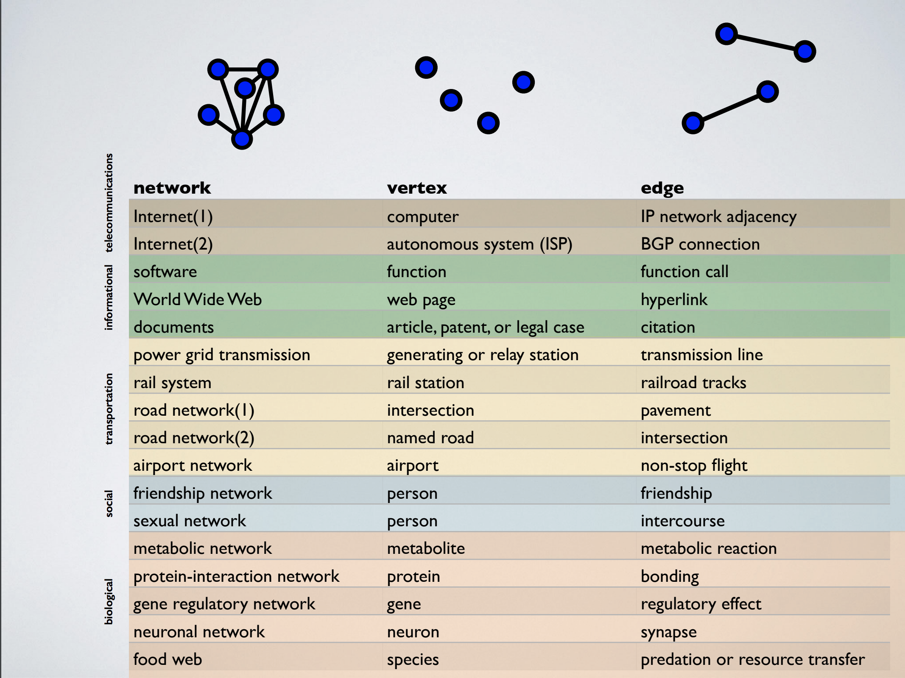

```{r}

library(igraph)
library(igraphdata)
library(visNetwork)
data(package = "igraphdata")
data(foodwebs)
```


Why igraph?

* Pretty fast for most things

* Many other pachages use it

* There are a ton of companion packages. If you want to do something you are working with using igraph, and it doesnt seem like igraph can do it, or igraph does it poorly, chances are theres a package which lets you do it/ do it better better using igraph formats

* Versions exist in R, Python, Matlab, C/C++ so data and pseudocode can be easily transferred between languages


#What are networks?
- A representation of individuals/components of a system and their connections which is defined in a way that allows us to analyze them mathematically and computationally

- Vertices/nodes/actors : Individuals/components

- Edges/ links/ ties : connections between individuals/components

A "graph" in mathematics is simply a set of vertices paired with the corresponding set of edges. A "network" is that, in addition to the other variables and properties associated with the vertices and edges

Examples:

<p style="text-align:left;"></p>

* [Some Publicly Available Networks](https://icon.colorado.edu/#!/networks)


#Making a network from scratch
```{r}
g<-make_empty_graph( directed = FALSE)
g <- g + vertices('Bio', 'Eco', 'CS', 'Soc', 'Psych', 'Econ')
plot(g, vertex.label.dist=3) #Add a little label distance so the labels dont overlap with the nodes. Easier to see
```

Adding edges is simple

```{r}
g <- g + edges(c('CS','Bio', 'CS','Eco', 'CS','Econ', 'CS','Soc', 'CS','Psych')) 
plot(g, vertex.label.dist=3)
```

You dont have to add all your edges at once

```{r}
g <- g + edges(c('Bio','Eco', 'Eco','Econ', 'Soc','Psych', 'Soc','Econ'))
plot(g, vertex.label.dist=3)
```


#Data structures of Networks

##Edge list


If you do not have any isolated nodes sitting unconnected, then just entering the list of connections is enough, without explicitly stating the nodes
```{r}
edgeList <- matrix( c('CS','Bio', 'CS','Eco', 'CS','Econ', 'CS','Soc', 'CS','Psych', 'Bio','Eco', 'Eco','Econ', 'Soc','Psych', 'Soc','Econ' ), nc = 2, byrow = TRUE)
print(edgeList)

edgeList2 <- as_edgelist(g, names = TRUE)
print(edgeList2)


gEdgeList<-graph_from_edgelist(edgeList, directed=FALSE)
plot(gEdgeList, vertex.label.dist=3)

gEdgeList2<-graph_from_edgelist(edgeList2, directed=FALSE)
plot(gEdgeList2, vertex.label.dist=3)
```

You can imagine how this would be useful if your data came in the form of a list of edges, as mine has in the past.


##Adjacency Matrix

```{r}
adjMatG <- as_adjacency_matrix(g) #get the adjacency matrix of g
print(adjMatG)
gAdjMat <- graph_from_adjacency_matrix(adjMatG, mode = "undirected") #create a new network from the adjacency matrix
plot(gAdjMat, vertex.label.dist=3)
```

In general, there are a million ways you can make the same network, and some are easier than others given the data you have and the format it is in. If one way is very hard, consider looking into another way. 


#Directed Networks

Directed networks are networks where an a connection between two nodes points from one node to the other in a way where the direciton of the pointing is important. Often the direction implies that something flows in that direction

Examples:

- Food Webs: A points to B if the biomass of A transfers to B (B eats A)

- Needle-sharing network: A points to B if B uses a needle after A (pathogen could spread from A to B)

- Citation Networks: A points to B if A cites B (an idea passes from A to B)


Simple example of directed network:
```{r}
adjMat <-matrix(data = 0, nrow=7,ncol=7)
species <- c('coyote', 'vulture', 'snake', 'grass', 'bug', 'hawk', 'mouse')
rownames(adjMat) <- colnames(adjMat) <- species
print(adjMat)


adjMat["grass","bug"] <-1
adjMat["bug","hawk"] <-1


adjMat["grass","mouse"] <-1
adjMat["mouse","hawk"] <-1
adjMat["mouse","coyote"] <-1
adjMat["mouse","snake"] <-1
adjMat["mouse","vulture"] <-1

adjMat["hawk","coyote"] <-1
adjMat["coyote","vulture"] <-1

adjMat["snake","vulture"] <-1


print(adjMat)
foodWeb <- graph_from_adjacency_matrix(adjMat)
plot(foodWeb, vertex.label.dist=3)
is_weighted(foodWeb)
```


#Weighted Networks
Weighted networks are networks where edges come with "weight" which usually implies something about the "strength" or "length" of that edge. 

Examples:

- Transportation networks: weights may imply distance

- Food web: weights can denote energy flux between species

- Water transfer networks: weights can denote rate of transfer


```{r}
#Check if your network is weighted
is_weighted(foodWeb)

adjMat["grass","bug"] <-0.2
adjMat["bug","hawk"] <-1


adjMat["grass","mouse"] <-0.8
adjMat["mouse","hawk"] <-0.2
adjMat["mouse","coyote"] <-0.2
adjMat["mouse","snake"] <-0.2
adjMat["mouse","vulture"] <-0.4

adjMat["hawk","coyote"] <-1
adjMat["coyote","vulture"] <-1

adjMat["snake","vulture"] <-1


print(adjMat)
foodWeb <- graph_from_adjacency_matrix(adjMat, weighted=TRUE)
plot(foodWeb, vertex.label.dist=3)
#Notice that nothing looks different

#Now check if your network is weighted again
is_weighted(foodWeb)

#Label the edges with weights
plot(foodWeb, vertex.label.dist=3, edge.label=E(foodWeb)$weight)
#Labelling edges is good when you need to know the exact values of weights, but it gets messy with big or dense networks(with alot of edges)

#Map edge weights to the widths of plotted edges
E(foodWeb)$width <- E(foodWeb)$weight 
plot(foodWeb, vertex.label.dist=3)
#This is good except some edges are too thin


# Modify edge widths to make it look better
E(foodWeb)$width <- E(foodWeb)$weight*4 
plot(foodWeb, vertex.label.dist=3)


```

In my example I weighted edges normalized to 1, to signify what percent of a population was being eaten by what, edges can be weighted in many different ways and need not be normalized to one. The method of weighting edges depends on the context of the system.
<p style="text-align:left;"></p>


#Working with existing data
```{r}

fwc <- foodwebs$CrystalC

plot(fwc, layout=layout_as_tree, vertex.label.dist=1.5)

plot(fwc, layout=layout_as_tree, vertex.label = 1:length(V(fwc)))

visIgraph(fwc, layout="layout_as_tree")


```


# Vertex Attributes      

Weight and direction are attributes of edges

Vertices also can have attributes.

So far we have used the vertex attribute "name", but vertices can have all sorts of attributes

```{r}
#Check current vertex attributes
vertex_attr_names(fwc)
```

##Continous vertex attributes
```{r}
V(fwc)$size <- V(fwc)$Biomass #note that we are setting a new vertex attribute
visIgraph(fwc, layout="layout_as_tree")


V(fwc)$size <- log1p(V(fwc)$Biomass)
visIgraph(fwc, layout="layout_as_tree")
```


##Categorical vertex attributes
```{r}


V(fwc)$color <- V(fwc)$ECO
visIgraph(fwc, layout="layout_as_tree")
```


#Network Analysis
Network analysis refers to analyzing existing networks

## Centrality
```{r}


#Degree
V(fwc)$size <- degree(fwc)
visIgraph(fwc, layout="layout_as_tree")

V(fwc)$size <- degree(fwc, mode="in")
visIgraph(fwc, layout="layout_as_tree")

V(fwc)$size <- degree(fwc, mode="out")
visIgraph(fwc, layout="layout_as_tree")


#Betweenness Centrality
V(fwc)$size <- log1p(betweenness(fwc))*5
visIgraph(fwc, layout="layout_as_tree")


#Closeness
#Calculated as the reciprocal of the sum of the length of the shortest paths between the node and all other nodes in the graph. Thus, the more central a node is, the closer it is to all other nodes.
V(fwc)$size <- closeness(fwc)*10^4
visIgraph(fwc, layout="layout_as_tree")
```

#Manipulating networks
```{r}
fwc <- foodwebs$CrystalC
fwc1 <- delete_vertices(fwc, c('Input','Output', "Respiration", 'detritus' ))
#V(fwc1)$size <-1
visIgraph(fwc, layout="layout_as_tree")
```


# Resources I used
- https://igraph.org/r/doc/
- https://jjborrelli.github.io/post/simple-food-web-plotting/
- http://tuvalu.santafe.edu/~aaronc/slides/Clauset_CSSS2014_Networks_1.pdf
- http://www2.unb.ca/~ddu/6634/Lecture_notes/Lec1_intro_handout.pdf
- https://www.rdocumentation.org/packages/visNetwork/versions/2.0.4/topics/visNetwork-igraph
- https://www.jessesadler.com/post/network-analysis-with-r/


