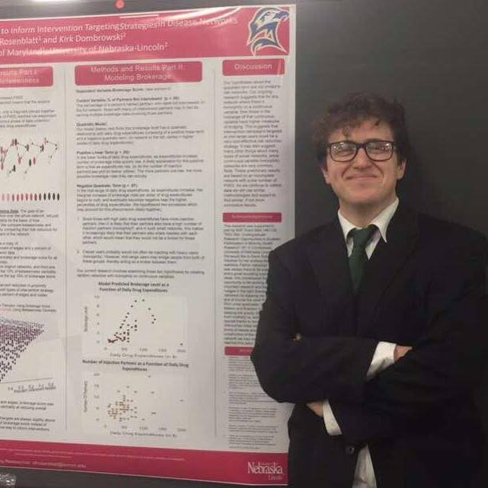

<body style="background-color:#e6ffff;">
</body>

### Computational Biology
### Fall 2018    

#### TA: Lauren Ash 
Office: Marsh Life Science 211   
Office Hours: Monday 2-3pm; Tuesday 11:30am-12:30pm    
Email: lvash@uvm.edu   

#### Student: Sam Rosenblatt 
Email: sfrosenb@uvm.edu   

<!--- This is how you comment stuff out so pandoc will ignore it  --->

<!-- This is how you comment stuff that doesnt need pandoc to ignore -->

<!--- 

  --->

<i> I learned how to do italicized text from Pokemon GO </i>

## Helpful Links   
* [Course Webpage](https://gotellilab.github.io/Bio381/)   
* [RMarkdown Cheatsheet](https://www.rstudio.com/wp-content/uploads/2015/02/rmarkdown-cheatsheet.pdf)   
* [Using prettydoc](http://yixuan.cos.name/prettydoc/)
* [Github website templates](https://github.com/jekyll/jekyll/wiki/Themes)   
* [R help](http://stackoverflow.com/questions/tagged/r)   
* [Git in RStudio Troubleshooting](Git_Troubleshooting.html)

## Table of contents of Homework Assignments    
* [08/29/2018 Homework 1: Setting up a webpage](#id-section1)
* [09/05/2018 Homework 2: Typora diagrams](#id-section2)
* [Homework 3: ](#id-section3)
* [Homework 4: ](#id-section4)
* [Homework 5: ](#id-section5)
* [Homework 6: ](#id-section6) 
* [Homework 7: ](#id-section7)
* [Homework 8: ](#id-section8)
* [Homework 9: ](#id-section9)   
* [Week 10: ](#id-section10)
* [Week 11: ](#id-section11)

## Homework Solutions and Notes

------

### Week 1: Setting up a webpage   
#### August 29, 2018   
[Assignment Page](https://gotellilab.github.io/Bio381/Homeworks/Homework01_2018.html)   
[Detailed Instructions from Lecture](https://gotellilab.github.io/Bio381/Lectures/Lecture01.html)   
   
**Due:**   
1. Your github homepage: https://github.com/sfrosenb

2. Your BIO 381 webpage: https://sfrosenb.github.io/RosenblattBio381/
   
   

------

### Week 2: Typora diagrams   
#### September 5, 2018   
[Assignment Page](https://gotellilab.github.io/Bio381/Homeworks/Homework02_2018.html)   

**Due:**   
1) **2 of the 4 diagrams** discussed in class: a) cause-and-effect diagram; b) pre-graph; c) DIPSwitch table c) logic tree    
[Link to HW2](Homework2Bio381.html)
2) Link to the homework on your webpage   
[Example using html](Dissertation_PathDiagram2.html)     
[Homework 2 Link](testimage.html)

------

### Week 3: 

[Homework 3](FirstBeamerPresentationPdf1.pdf) 
       

------

### Week 4:    

[Homework 4](Homework4.html)  
      

------

   
### Week 5: 

[Homework 5](Homework5.html)
   
 
------

   
### Week 6: 
[Homework 6](Homework6.html)

------

### Week 7: 

------

### Week 8:  

Due:   
   

------

### Week 9: 

Due:   

------

### Week 10:    

------

### Week 11:   
